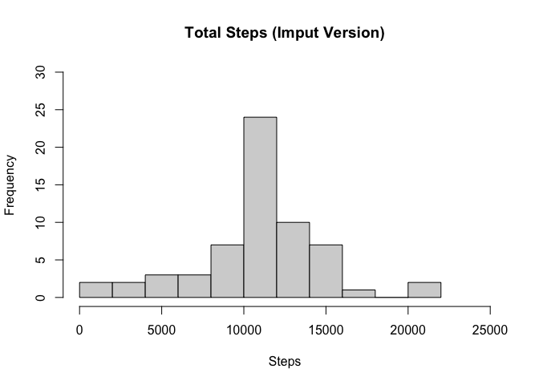

Isaac Carey, 25 Mar 2021

## Loading and preprocessing the data

```r
unzip(zipfile = 'activity.zip', exdir = getwd())
df <- read.csv('activity.csv')
library(dplyr, warn.conflicts = FALSE, quietly = TRUE)
df$date <- as.Date(df$date, "%Y-%m-%d")
totals <- aggregate(steps~date, df,sum)
```

```r
head(df)
```

```
##   steps       date interval
## 1    NA 2012-10-01        0
## 2    NA 2012-10-01        5
## 3    NA 2012-10-01       10
## 4    NA 2012-10-01       15
## 5    NA 2012-10-01       20
## 6    NA 2012-10-01       25
```

```r
tail(df)
```

```
##       steps       date interval
## 17563    NA 2012-11-30     2330
## 17564    NA 2012-11-30     2335
## 17565    NA 2012-11-30     2340
## 17566    NA 2012-11-30     2345
## 17567    NA 2012-11-30     2350
## 17568    NA 2012-11-30     2355
```
## What is mean total number of steps taken per day?

```r
hist(totals$steps, main = 'Histogram of Total Steps per Day', breaks = 15, xlab = 'Steps', xlim = c(0, 25000))
```

<!-- -->

```r
mean(totals$steps)
```

```
## [1] 10766.19
```

```r
median(totals$steps)
```

```
## [1] 10765
```

## What is the average daily activity pattern?

```r
byInt <- aggregate(steps~interval, df, sum)
byInt <- mutate(byInt, intAve = steps/53)
plot(x = byInt$interval, y = byInt$intAve, type ='l', xlab = '5-minute intervals', 
     ylab = 'Average number of steps taken', 
     main = 'Plot of Intervals vs Average Steps')
```

<!-- -->

```r
with(byInt, interval[which.max(intAve)])
```

```
## [1] 835
```

It appears that the highest average interval is at 0835. This makes sense, as many people are walking to work at that time on weekdays.

## Imputing missing values
Missing values were replaced with the mean for that 5-minute interval.

```r
imputedFrame <- df
sum(is.na(imputedFrame$steps))
```

```
## [1] 2304
```

There are 2304 missing step values.


```r
for (missingValue in which(is.na(imputedFrame$steps))){
  imputedFrame$steps[missingValue] <- byInt[which(byInt$interval == imputedFrame$interval[missingValue]), 'intAve']
  }
imputTotals <- aggregate(steps~date, imputedFrame, sum)
hist(imputTotals$steps, main = 'Total Steps (Imput Version)', xlab = 'Steps', breaks = 15, ylim = c(0, 30), xlim = c(0, 25000))
```

<!-- -->

```r
mean(imputTotals$steps)
```

```
## [1] 10766.19
```

```r
median(imputTotals$steps)
```

```
## [1] 10766.19
```

As expected, the imputed data brought the mean and median together exactly, and resulted in a higher peak for the historgram. The mean did not change with the addition of these values.

## Are there differences in activity patterns between weekdays and weekends?

```r
weekends <- filter(imputedFrame, weekdays(imputedFrame$date) %in% c("Saturday", "Sunday"))
weekdays <- filter(imputedFrame, !(weekdays(imputedFrame$date) %in% c("Saturday", "Sunday")))
weekdayTotals <- aggregate(steps~interval, weekdays, sum)
weekendTotals <- aggregate(steps~interval, weekends, sum)
weekdayAve <- mutate(weekdayTotals, average = steps/14)
weekendAve <- mutate(weekendTotals, average = steps/39)
par(mfrow=c(2,1))
plot(weekendAve$interval, weekendAve$average, type = 'l', xlab = 'Interval', ylab = 'Steps', main = 'Weekend')
plot(weekdayAve$interval, weekdayAve$average, type = 'l', xlab = 'Interval', ylab = 'Steps', main = 'Weekday')
```

<!-- -->

```r
with(weekendAve, average[which.max(average)])
```

```
## [1] 68.36478
```

```r
with(weekdayAve, average[which.max(average)])
```

```
## [1] 740.5013
```

Looking at the plot, it is clear that there are differences in the activity patterns. 

* Most noticeably is the volume of steps on the weekdays. The highest weekday average is 740 steps, over ten times higher than the highest weekend average of 68 steps.
* There is a large amount of activity shortly before 0900 on weekdays. This likely corresponds to the start of the workday, as previously discussed.
* On weekends, there is less activity earlier in the morning because most people are able to sleep later.

Thanks for reading through this. 
